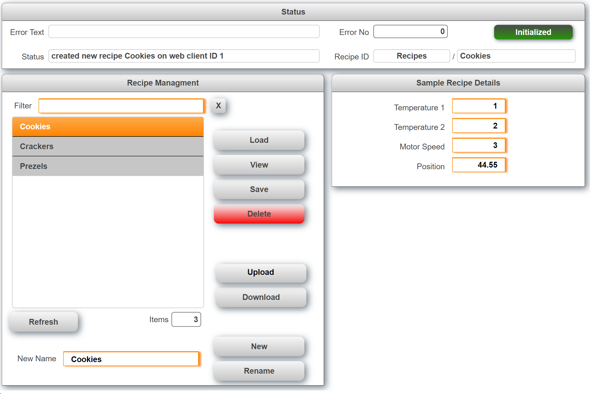

## Table of Contents
* [Introduction](#Introduction)
* [Requirements](#Requirements)
* [Revision History](#Revision-History)

## Introduction
This is a sample project for a recipe management with mappView. It uses B&R mappRecipe to access the recipe data and supports up to 3 concurrent web clients as well as Unicode recipe names. Unicode names are required for language that require special fonts (Chinese, Japanese, Russian, ..).

Also see [**How to import the user management into an existing project.**](/Logical/mappRecipe/HowToImport.pdf) Download the latest release from [**here.**](../../releases) When upgrading from a previous version make sure to delete the files that were imported before. Detailed information are available in the [**Wiki**](https://github.com/br-automation-com/mappView-Recipe/wiki). This sample can run in simualtion mode (http://127.0.0.1:81/).

## Requirements
* Automation Studio 4.5
* mappView 5.71
* mappServices 5.71
* Automation Runtime B4.53

Recommended task class is #8 with a 10ms cycle time.

## Revision History

#### Version 0.6
- Option to sort recipe names as numeric values instead of alphabetic
- Code cleanup
- Renamed web controls to avoid conflicts with other samples
- Fixed download not working when downloading the same file again
- Fixed upload not working with large files > 1 MB
